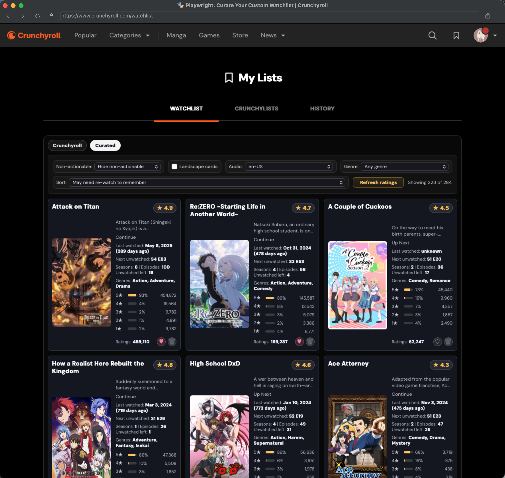

# Crunchy Watchlist Curator (Cross-Browser Web Extension)

Crunchy Watchlist Curator turns Crunchyroll's watchlist into a decision-ready queue so you can pick what to watch next in seconds instead of endless scrolling.



## Why use it

- Clean up noisy watchlists packed with already-watched or currently non-actionable shows so you can focus on what is actually worth watching next.
- Surface the right next show faster with smart sort modes like `Hidden gems`, `Quick wins`, `Dormant backlog`, and `May need re-watch to remember`.
- Focus only on what matters with non-actionable filtering, audio/genre filters, portrait/landscape card toggles, and English-audio-only filtering (`en-US`) when you want it.
- Make better watch decisions with rich card context: ratings, vote volume, watch recency, next-episode progress, and genre metadata.

## Everything it adds

This extension improves `https://www.crunchyroll.com/watchlist` by adding:

- A separate `Curated` tab (leaves Crunchyroll's native tab content untouched)
- A 3-way non-actionable mode selector: `None` / `Dim non-actionable` / `Hide non-actionable`
- An `Audio` dropdown filter (from available `audio_locales`, including `en-US`)
- A `Genre` dropdown filter (from available series category/genre tags)
- A `Landscape cards` toggle to switch between portrait and landscape card layouts
- Rich rating UI on curated cards (score, rating count, 5-star histogram)
- Layout-aware cover art selection (portrait cards prefer tall posters; landscape cards prefer wide posters)
- Small per-show description snippet on each curated card
- `Last watched` line on each card (with relative age)
- Next unwatched episode line (`Sx Ey`) plus series totals (`seasons`, `episodes`, and estimated `unwatched left` when calculable)
- Genre/category line when available from Crunchyroll metadata
- A `Sort` selector for rating/date/rating-volume metrics plus discovery modes: `Hidden gems`, `Consensus quality`, `Controversial`, `Quality floor`, `Quick wins`, `Dormant backlog`, and `May need re-watch to remember`
- Native action buttons on curated cards (`Favorite` heart and `Remove` trash)
- Hover preview on curated thumbnails when a stream preview URL is available

## Files

- `extension/manifest.json`
- `extension/content.js`
- `extension/content.css`
- `docs/end-user-installation.md` (manual installation guide for Chrome, Edge, Firefox, Safari)
- `docs/release-checklist.md` (publish readiness checklist for all target browsers)
- `docs/crunchyroll-watchlist-findings.md` (live selectors, API/auth endpoints, reverse-engineering notes)

## End-user installation

See `docs/end-user-installation.md` for browser-specific steps.

Quick summary:

- Chrome: install unpacked extension from `dist/chrome/unpacked`
- Edge: install unpacked extension from `dist/edge/unpacked`
- Firefox: load temporary add-on from `dist/firefox/unpacked` or use signed `.xpi`
- Safari: install the packaged app build and enable extension in Safari settings

## Store install links

Add official listing links here once published:

- Chrome Web Store: `TBD`
- Edge Add-ons: `TBD`
- Firefox Add-ons (AMO): `TBD`
- Mac App Store (Safari wrapper app): `TBD`

## Load in Chrome, Edge, and Firefox (Dev)

1. Build browser-specific unpacked bundles:

   ```bash
   npm run build:webext
   ```

2. Load the right unpacked folder in each browser:

   - Chrome: `dist/chrome/unpacked`
   - Edge: `dist/edge/unpacked`
   - Firefox: `dist/firefox/unpacked`

## Build distributables

Build all web-extension distributables:

```bash
npm run build:webext
```

Build one browser at a time:

```bash
npm run build:webext:chrome
npm run build:webext:edge
npm run build:webext:firefox
```

Outputs:

- `dist/chrome/crunchy-watchlist-curator-chrome.zip`
- `dist/edge/crunchy-watchlist-curator-edge.zip`
- `dist/firefox/crunchy-watchlist-curator-firefox.zip`
- `dist/firefox/crunchy-watchlist-curator-firefox.xpi`

Firefox package IDs can be overridden with:

```bash
FIREFOX_EXTENSION_ID=your-addon-id@example.com npm run build:webext:firefox
```

## Load in Safari (Xcode Wrapper)

1. Open the existing Xcode project in `Crunchy Watchlist Curator/`.
2. Build and run the extension target.
3. In Safari, enable the extension in:
   `Safari > Settings > Extensions`.

### Xcode Target Note (iOS vs macOS)

The converter creates both iOS and macOS wrapper targets by default. For Safari on Mac, run:

- Scheme: `Crunchy Watchlist Curator (macOS)`
- Destination: `My Mac`
- Extension target used: `Crunchy Watchlist Curator Extension (macOS)`

You can ignore iOS targets unless you also want Safari on iOS support.

Build an unsigned Safari artifact bundle locally:

```bash
npm run build:safari
```

Outputs:

- `dist/safari/crunchy-watchlist-curator-safari-macos-app.zip`
- `dist/safari/crunchy-watchlist-curator-safari-webextension-source.zip`

## Playwright Setup (Cross-Engine Validation)

This repo includes Playwright tooling to test the same content-script behavior in Chromium, Firefox, and WebKit.

1. Install dependencies:

   ```bash
   npm install
   ```

2. Install Playwright runtimes:

   ```bash
   npm run pw:install
   ```

3. Run automated fixture tests in all engines:

   ```bash
   npm run test:e2e
   ```

4. (Optional) Run per-engine:

   ```bash
   npm run test:e2e:chromium
   npm run test:e2e:firefox
   npm run test:e2e:webkit
   ```

5. (Optional) Run with Playwright UI:

   ```bash
   npm run test:e2e:ui
   ```

## Live WebKit Visual Session

For manual visual checks on the real Crunchyroll watchlist (WebKit browser, not Safari):

```bash
npm run pw:live
```

This opens a persistent WebKit profile and injects `extension/content.js` + `extension/content.css` into `https://www.crunchyroll.com/watchlist`.

Use this for quick interactive checks. Final extension behavior still needs Safari/Xcode validation.

`pw:live` keeps injection active across login/redirect navigation, enables hot reload by default, and prints status lines like:

- `[startup] /watchlist nativeCards=... curatedCards=... controls=yes`
- `[watchlist-nav] /watchlist nativeCards=... curatedCards=... controls=yes`

Hot reload only reloads when file content actually changes (no-op for noisy watch events).

To disable hot reload explicitly:

```bash
CW_PW_HOT_RELOAD=0 npm run pw:live
```

Edits to `extension/content.js` or `extension/content.css` trigger:

- `[hot-reload] Reloading page and applying latest extension files...`

## Firefox publish validation

Run Firefox-focused linting on the browser-specific manifest package:

```bash
npm run lint:firefox
```

## CI artifacts

GitHub Actions workflow `.github/workflows/build-extensions.yml` verifies portability and uploads artifacts for:

- Chrome package
- Edge package
- Firefox package (`.zip` + `.xpi`)
- Safari macOS wrapper build output

Artifact names uploaded by CI:

- `extension-chrome`
- `extension-edge`
- `extension-firefox`
- `extension-safari`

## Release process

Use `/Users/matthewfrench/GitHub/Crunchy-Watchlist/docs/release-checklist.md` before publishing a new version.

## Use (Real Site)

1. Open [https://www.crunchyroll.com/watchlist](https://www.crunchyroll.com/watchlist).
2. Use the tabs:
   - `Crunchyroll`: native watchlist (untouched)
   - `Curated`: extension-managed view
3. In `Curated`, use the toggles/selects to filter, sort, and switch card orientation.
4. Use `Refresh ratings` if you want to clear cached metadata (`ratings` and `watch-history`) and refetch.

## Behavior Notes

- `Non-actionable`, `Audio`, `Genre`, `Sort`, and `Landscape cards` selections all persist in extension storage so your view stays consistent across reloads.
- `Curated` is API-driven: it fetches all watchlist pages up front via Crunchyroll API pagination, preloads ratings in batch CMS calls, and preloads watch history in paged account-level calls.
- Ratings and watch-history data are cached locally for 12 hours.
- `Last watched` is sourced from `date_played` in `/content/v2/<accountId>/watch-history`, joined by `series_id`; if no match exists, cards show `unknown` (or `never` when Crunchyroll marks series as never watched).
- API-call strategy is bounded and avoids one-request-per-show loops in normal flow.
- Typical cold-load call pattern:
  - 1x `POST /auth/v1/token`
  - 1-3x watchlist pagination calls (`n=100`)
  - 1-Nx rating batch calls (`/content/v2/cms/objects/<comma_separated_ids>`, chunked)
  - 1-Nx watch-history page calls (`/content/v2/<accountId>/watch-history?page_size=100&page=...`, early-stop after several no-match pages)
- If API auth/loading fails, `Curated` shows an explicit API error instead of falling back to partial DOM-loaded rows.
- `Curated` shows a spinner while loading, and data preload starts in the background as soon as the watchlist page is ready.
- Crunchyroll native watchlist uses virtualization; `Curated` renders its own full-data list, so sorting/filtering is controlled entirely by the extension UI.
- Curated `Favorite`/`Remove` buttons forward clicks to Crunchyroll's native controls; nothing is triggered automatically.
- Because native watchlist is virtualized, action forwarding requires that native controls for that show have been loaded at least once in the native tab.

## Local fixture data

Automated tests use a local fixture server (`tests/server.mjs`) and fixture page (`tests/fixtures/watchlist-fixture.html`) so UI logic can be validated quickly without account/login dependencies.

## License

This project is licensed under the GNU General Public License v3.0 only (`GPL-3.0-only`). See `LICENSE`.

## Legal Notice

- Crunchy Watchlist Curator is an independent, unofficial project and is not affiliated with, endorsed by, or sponsored by Crunchyroll, LLC, Sony Group Corporation, or their affiliates.
- The GPL license in this repository applies only to the original code and assets included in this project. It does not grant any rights to Crunchyroll trademarks, logos, branding, or third-party content and services.
