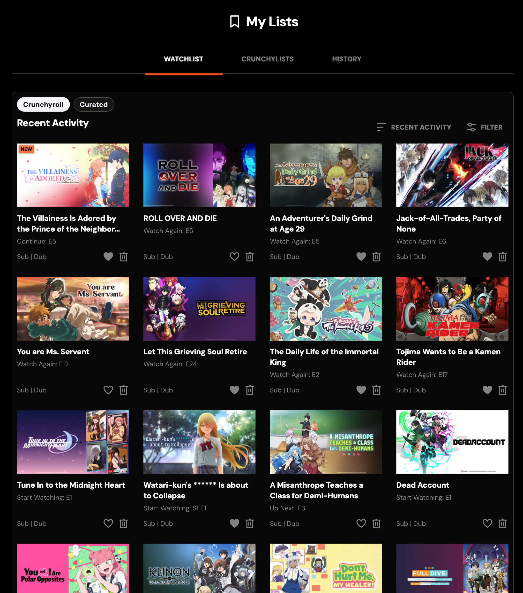
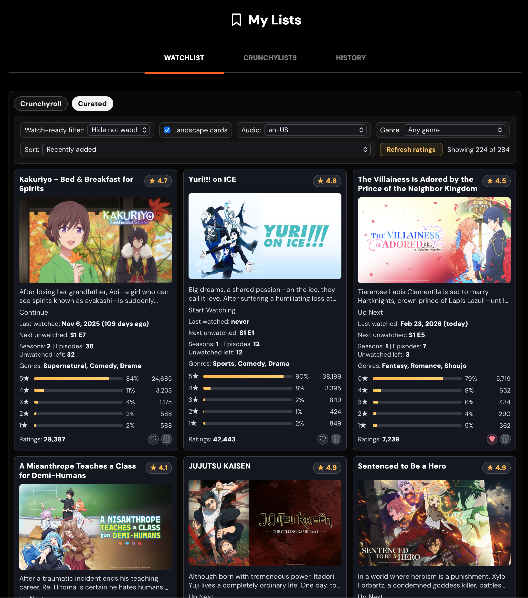
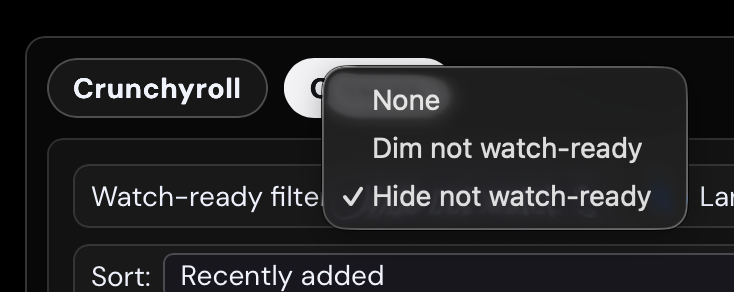
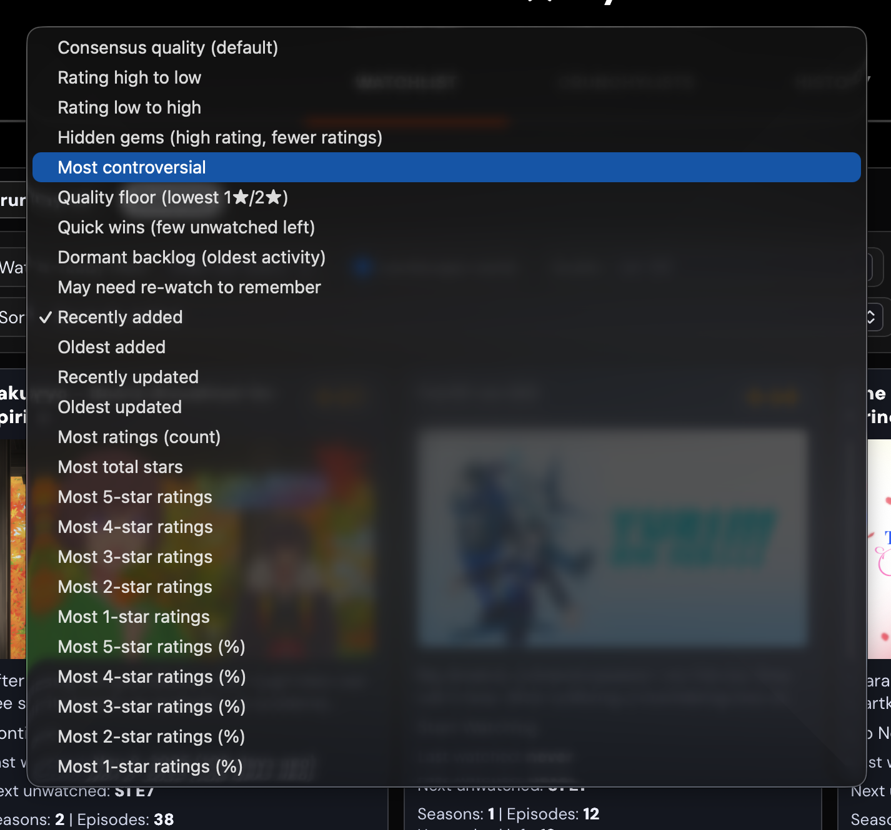
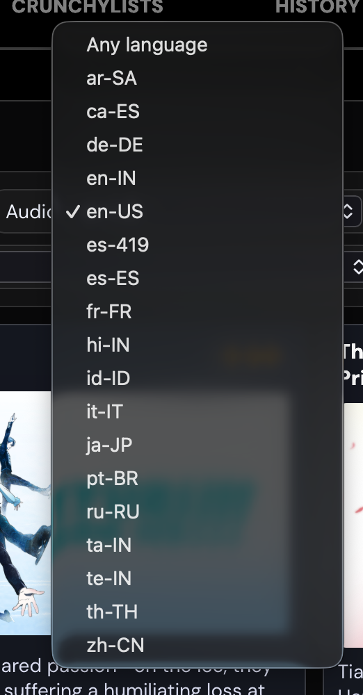

#  Crunchy Watchlist Curator 

Turn Crunchyroll’s “watch later” chaos into a clean, decision-ready queue.

Crunchy Watchlist Curator injects a curated companion tab into your Crunchyroll watchlist so you can choose what to watch next in seconds, not minutes.

## Before vs after

<p align="center">
  
  
</p>

## Why this exists

People open their watchlists, see too many titles, and end up re-sorting mentally every time. This extension automates that first pass.

- Removes noise from the list (`already-watched`, `finished`, and titles that are not currently watch-ready)
- Surfaces “what now?” choices fast with smart sort modes
- Keeps context visible (`rating`, `next episode`, genre, last activity, ratings volume)
- Lets you tune the list for your exact viewing mood (`audio`, `genre`, card layout, filters)

## Feature callouts

<table>
  <tr>
    <td width="50%" valign="top">
      <strong>Watch-ready filtering</strong><br />
      <sub>Switch between <code>None</code>, <code>Dim</code>, and <code>Hide</code> for non-watch-ready titles.</sub><br /><br />
      
      <br /><br />
      <strong>Deep sort mode coverage</strong><br />
      <sub>Discovery-first, quality-first, and ratings-distribution sort modes in one menu.</sub><br /><br />
      
    </td>
    <td width="50%" valign="top">
      <strong>Audio locale filtering</strong><br />
      <sub>Filter your queue by dub/sub language availability, including <code>en-US</code>.</sub><br /><br />
      
    </td>
  </tr>
</table>

## At a glance

- **Works on**: Chromium, Edge, Firefox, Safari (via macOS wrapper)
- **Goal**: Make watchlist browsing fast and intentional
- **Mode**: Browser extension (`Content.js` + `Content.css`)
- **License**: GPL-3.0-only
- **Type**: Unofficial community project (not affiliated with Crunchyroll)

## ✨ Highlights

- Dedicated **Curated** tab (native Crunchyroll tab stays untouched)
- **Watch-ready filtering** (UI label: `Watch-ready filter`): `None`, `Dim`, `Hide`

Not-watch-ready titles include entries Crunchyroll marks as `watch again`, `rewatch`, `coming soon`, `unavailable`, or already fully watched.
- **Filters**: audio locale (including `en-US`) and genres
- **Card layout modes**: portrait and landscape
- Rich card metadata: scores, vote count, histogram, genre metadata, description
- **Sort options** for discovery and quality signals:
  - Consensus quality
  - Hidden gems
  - Quick wins
  - Dormant backlog
  - Controversial
  - Quality floor
  - May need re-watch to remember
- Episode progress quickly visible: `last watched`, `next unwatched`, totals, remaining estimate
- Native actions from card UI (`Favorite`, `Remove`) with no behavior changes
- Hover preview where available

## Quick start (new users)

1. Install/unpack for your browser (see section below)
2. Open `https://www.crunchyroll.com/watchlist`
3. Switch to the **Curated** tab
4. Pick a `Sort` mode + set filters
5. Start watching with confidence instead of endless scrolling

> If this is your first time, start with `Consensus quality` + `Genre` filters, then switch to `Quick wins` for immediate options.

## Installation

### Browser builds (developer/unofficial)

If no store listing is published yet, use manual install paths.

| Browser | Build artifact | How to install |
| --- | --- | --- |
| Chrome | `dist/chrome/unpacked` | Enable developer mode in extensions, load unpacked |
| Edge | `dist/edge/unpacked` | Enable developer mode in extensions, load unpacked |
| Firefox | `dist/firefox/unpacked` | Temporary Add-on from this folder |
| Safari | `dist/safari/...` | Open Safari wrapper project in Xcode and enable website access |

```bash
npm run build:webext
```

Then load:
- `dist/chrome/unpacked`
- `dist/edge/unpacked`
- `dist/firefox/unpacked`

Safari local dev/test flow:

```bash
npm run build:safari
```

Then follow the existing Safari wrapper steps in the docs.

For complete installation instructions by browser (including Safari wrapper caveats and local testing workflow), see `docs/end-user-installation.md`.

### Distribution and validation docs

Chrome, Edge, Firefox AMO, and Safari signing workflows are documented and kept in the release checklist.

- `docs/end-user-installation.md`
- `docs/release-checklist.md`
- `docs/testing.md`
- `docs/api-endpoints-reference.md`

Run `docs/testing.md` for Playwright + local browser validation instructions.

## Build commands

```bash
npm install
npm run pw:install
npm run typecheck
npm run lint
npm run build:runtime      # prepare generated extension runtime in .tmp/extension-runtime-dev
npm run build:runtime:webext # web-extension runtime output in .tmp/extension-runtime-webext
npm run build:runtime:safari # Safari runtime output in .tmp/extension-runtime-safari
npm run build:runtime:safari:checked # runtime tsc check + Safari runtime output
npm run build:runtime:e2e    # Playwright runtime output in .tmp/extension-runtime-e2e
npm run build:webext        # all web-extension packages
npm run build:webext:chrome # Chrome only
npm run build:webext:edge   # Edge only
npm run build:webext:firefox # Firefox only
npm run build:safari       # Safari artifacts
```

```bash
npm run test:e2e                 # cross-engine Playwright smoke/e2e
npm run test:e2e:chromium
npm run test:e2e:firefox
npm run test:e2e:webkit
npm run pw:live                  # interactive WebKit watchlist session
npm run pw:live:smoke            # non-interactive generated-runtime parity check for live injection
npm run lint:firefox             # Firefox manifest + package lint
npm run format:check             # Biome format check on configured paths
```

## How it works

The extension takes control of your watchlist UI using a background metadata layer:

- Fetches watchlist items via API pagination
- Fetches ratings and watch history in batched requests
- Caches enriched data for 12 hours
- Builds a full curated list in-browser so sorting/filtering is deterministic
- Preserves native actions by forwarding existing Crunchyroll controls

This means sorting stays stable and fast even with large lists.

## Files that matter

- `extension/manifest.json`
- `extension/Content.js`
- `extension/Content.css`
- `scripts/*` (build / release tooling)
- `tests/*` (e2e + fixtures)
- `docs/*` (installation, release, and findings)

## Troubleshooting (fast)

- If the Curated tab stays empty: refresh ratings/history cache with `Refresh ratings`.
- If a show action fails: native watchlist controls may not be loaded yet due to virtualization.
- If login state is stale: sign out/in on Crunchyroll, then reopen watchlist.
- Firefox temporary add-on users: extension resets on restart by design.
- Safari quick diagnostics:
  - Open page Web Inspector on `https://www.crunchyroll.com/watchlist`.
  - Run `window.__CW_WATCHLIST_CURATOR_DIAGNOSTICS__` in the console.
  - `stage: "init-complete"` means the runtime started; any `stage` ending with `error` or `missing-*` points to the exact bootstrap failure.

## Release and contributors

### CI and verification

GitHub Actions validates Chromium/Firefox/WebKit and publishes release artifacts for Chrome, Edge, Firefox, and Safari artifacts under the current workflow config.

### Contributing

1. Open an issue with expected behavior and repro steps
2. Add/update a test in `tests/` when behavior changes
3. Build and run relevant commands before opening PR

## Legal

- Crunchy Watchlist Curator is an independent, unofficial project and is not affiliated with, sponsored by, or endorsed by Crunchyroll, LLC, Sony Group Corporation, or any affiliates.
- The project’s GPL-3.0-only license applies to repository code and assets only. It does not grant rights to Crunchyroll marks, logos, or services.
